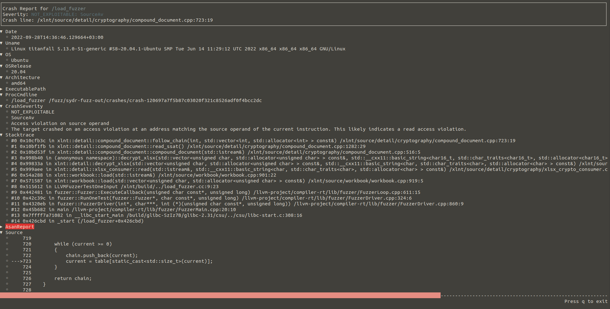

[](https://crates.io/crates/casr)
[](https://docs.rs/libcasr)
[](https://codecov.io/github/ispras/casr)
[](https://github.com/ispras/casr/blob/master/LICENSE)

[](https://github.com/ispras/casr/actions/workflows/amd64.yml)
[](https://github.com/ispras/casr/actions/workflows/aarch64.yml)
[](https://github.com/ispras/casr/actions/workflows/riscv64.yml)
[](https://github.com/ispras/casr/actions/workflows/fuzzing.yml)

# CASR: Crash Analysis and Severity Report

CASR &ndash; collect crash (or UndefinedBehaviorSanitizer error) reports, triage, and estimate severity.
It is based on ideas from [exploitable](https://github.com/jfoote/exploitable) and
[apport](https://github.com/canonical/apport).

CASR is maintained by:

* [Andrey Fedotov](https://github.com/anfedotoff) \<splashgitar@gmail.com\>
* [Alexey Vishnyakov](https://github.com/SweetVishnya) \<pmvishnya@gmail.com\>
* [Georgy Savidov](https://github.com/Avgor46) \<avgor46@ispras.ru\>
* [Ilya Yegorov](https://github.com/hkctkuy) \<Yegorov_Ilya@ispras.ru\>
* [Darya Parygina](https://github.com/PaDarochek) \<pa_darochek@ispras.ru\>

## Overview

CASR is a set of tools that allows you to collect crash reports in different
ways. Use `casr-core` binary to deal with coredumps. Use `casr-san` to analyze
ASAN reports or `casr-ubsan` to analyze UBSAN reports. Try `casr-gdb` to get
reports from gdb. Use `casr-python` to analyze python reports and get report
from [Atheris](https://github.com/google/atheris). Use `casr-java` to analyze
java reports and get report from
[Jazzer](https://github.com/CodeIntelligenceTesting/jazzer).

Crash report contains many useful information: severity (like [exploitable](https://github.com/jfoote/exploitable))
for x86, x86\_64, arm32, aarch64, rv32g, rv64g architectures,
OS and package versions, command line, stack trace, register values,
disassembly, and even source code fragment where crash appeared. Reports are
stored in JSON format. `casr-cli` is meant to provide TUI for viewing reports
and converting them into SARIF report.
Reports triage (deduplication, clustering) is done by `casr-cluster`.
Triage is based on stack trace comparison from [gdb-command](https://github.com/anfedotoff/gdb-command).
`casr-afl` is used to triage crashes found by [AFL++](https://github.com/AFLplusplus/AFLplusplus).
`casr-libfuzzer` can triage crashes found by
[libFuzzer](https://www.llvm.org/docs/LibFuzzer.html) based fuzzer
(C/C++/[go-fuzz](https://github.com/dvyukov/go-fuzz)/[Atheris](https://github.com/google/atheris)
/[Jazzer](https://github.com/CodeIntelligenceTesting/jazzer)).
`casr-dojo` allows to upload new and unique CASR reports to
[DefectDojo](https://github.com/DefectDojo/django-DefectDojo) (available with
`dojo` feature).

Explanation of severity classes could be found [here](docs/classes.md).
You could take a closer look at usage details [here](docs/usage.md).




### LibCASR

LibCASR provides API for parsing stacktraces, collecting crash reports,
triaging crashes (deduplication and clustering), and estimating severity of
crashes.

It can analyze crashes from different sources:

* AddressSanitizer
* UndefinedBehaviorSanitizer
* Gdb output

and program languages:

* C/C++
* Rust
* Go
* Python
* Java

It could be built with `exploitable` feature for severity estimation crashes
collected from gdb. To save crash reports as json use `serde` feature.

## Dependencies

Install build dependencies:

    $ sudo apt install build-essential clang

Install [Rust](https://www.rust-lang.org/tools/install) or update existing Rust installation:

    $ rustup update

Install runtime dependencies:

    $ sudo apt install gdb lsb-release

## Install

Build from Git repository:

    $ git clone https://github.com/ispras/casr
    $ cargo build --release

Or you may just install Casr from [crates.io](https://crates.io/crates/casr):

    $ cargo install casr

Add `dojo` feature if you want to install `casr-dojo` (the same for `cargo build`):

    $ cargo install -F dojo casr

## Usage

Create report from coredump:

    $ casr-core -f casr/tests/casr_tests/bin/core.test_destAv -e casr/tests/casr_tests/bin/test_destAv -o destAv.casrep

Create report from AddressSanitizer output:

    $ clang++ -fsanitize=address -O0 -g casr/tests/casr_tests/test_asan_df.cpp -o test_asan_df
    $ casr-san -o asan.casrep -- ./test_asan_df

Create report from UndefinedBehaviorSanitizer output:

    $ clang++ -fsanitize=undefined -O0 -g casr/tests/casr_tests/ubsan/test_ubsan.cpp -o test_ubsan
    $ casr-ubsan -i casr/tests/casr_tests/ubsan/input1 -o output -- ./test_ubsan @@
    $ casr-cli output

Create report from gdb:

    $ casr-gdb -o destAv.gdb.casrep -- casr/tests/casr_tests/bin/test_destAv $(printf 'A%.s' {1..200})

Create report from python:

    $ casr-python -o python.casrep -- casr/tests/casr_tests/python/test_casr_python.py

Create report from java:

    $ casr-java -o java.casrep -- java casr/tests/casr_tests/java/Test1.java

View report:

    $ casr-cli casr/tests/casr_tests/casrep/test_clustering_san/load_fuzzer_crash-120697a7f5b87c03020f321c8526adf0f4bcc2dc.casrep

View joint statistics about crash clusters:

    $ casr-cli casr_reports

Convert reports to SARIF report:

    $ casr-cli --sarif out.sarif --tool libfuzzer --source-root /xlnt casr/tests/casr_tests/casrep/test_clustering_san

Create report for program that reads stdin:

    $ casr-san --stdin seed -o san_bin.casrep -- ./san_bin

Deduplicate reports:

    $ casr-cluster -d casr/tests/casr_tests/casrep/test_clustering_gdb out-dedup

Cluster reports:

    $ casr-cluster -c out-dedup out-cluster

Triage crashes after AFL++ fuzzing with casr-afl:

    $ cp casr/tests/casr_tests/bin/load_afl /tmp/load_afl
    $ cp casr/tests/casr_tests/bin/load_sydr /tmp/load_sydr
    $ casr-afl -i casr/tests/casr_tests/casrep/afl-out-xlnt -o casr/tests/tmp_tests_casr/casr_afl_out
    $ # You may also additionally generate crash reports for uninstrumented binary with casr-gdb
    $ casr-afl -i casr/tests/casr_tests/casrep/afl-out-xlnt -o casr/tests/tmp_tests_casr/casr_afl_out -- /tmp/load_sydr @@

Triage libFuzzer crashes with casr-libfuzzer:

    $ casr-libfuzzer -i casr/tests/casr_tests/casrep/libfuzzer_crashes_xlnt -o casr/tests/tmp_tests_casr/casr_libfuzzer_out -- casr/tests/casr_tests/bin/load_fuzzer

Triage Atheris crashes with casr-libfuzzer:

    $ unzip casr/tests/casr_tests/python/ruamel.zip
    $ cp casr/tests/casr_tests/python/yaml_fuzzer.py .
    $ casr-libfuzzer -i casr/tests/casr_tests/casrep/atheris_crashes_ruamel_yaml -o casr/tests/tmp_tests_casr/casr_libfuzzer_atheris_out -- ./yaml_fuzzer.py

Upload new and unique CASR reports to
[DefectDojo](https://github.com/DefectDojo/django-DefectDojo):

    $ echo '[product]' > dojo.toml
    $ echo 'name = "xlnt"' >> dojo.toml
    $ echo '[engagement]' >> dojo.toml
    $ echo "name = \"load_fuzzer $(date -Isec)\"" >> dojo.toml
    $ echo '[test]' >> dojo.toml
    $ echo 'test_type = "CASR DAST Report"' >> dojo.toml
    $ casr-dojo -i casr/tests/casr_tests/casrep/test_clustering_san -u http://localhost:8080 -t 382f5dfdf2a339f7c3bb35442f9deb9b788a98d5 dojo.toml

## Fuzzing Crash Triage Pipeline

When you have crashes from fuzzing you may do the following steps:

1. Create reports for all crashes via `casr-san`, `casr-gdb` (if no sanitizers
   are present), `casr-python`, or `casr-java`.
2. Deduplicate collected crash reports via `casr-cluster -d`.
3. Cluster deduplicated crash reports via `casr-cluster -c`.
4. Create reports and deduplicate them for all UBSAN errors via `casr-ubsan`.
5. View reports from clusters using `casr-cli` or upload them to
   [DefectDojo](https://github.com/DefectDojo/django-DefectDojo) with
   `casr-dojo`.

If you use [AFL++](https://github.com/AFLplusplus/AFLplusplus), the pipeline
(without `casr-ubsan` and `casr-dojo`) could be done automatically by
`casr-afl`.

If you use [libFuzzer](https://www.llvm.org/docs/LibFuzzer.html) based fuzzer
(C/C++/[go-fuzz](https://github.com/dvyukov/go-fuzz)/[Atheris](https://github.com/google/atheris)),
the pipeline (without `casr-ubsan` and `casr-dojo`) could be done automatically
by `casr-libfuzzer`.

## Contributing

Feel free to open [issues](https://github.com/ispras/casr/issues) or [PRs](https://github.com/ispras/casr/pulls) (especially pay attention to [help wanted](https://github.com/ispras/casr/issues?q=is%3Aopen+is%3Aissue+label%3A%22help+wanted%22) issues)! We appreciate your support!

Please follow the next recommendations for your pull requests:

- compile with *stable* rust
- use `cargo fmt`
- check the output of `cargo clippy --all-features --all --tests`
- run tests `cargo test`
- if you have updated usage of any casr tool, you could simply run
  `update_usage.py` to change the `docs/usage.md` file properly

## Cite Us

Savidov G., Fedotov A. Casr-Cluster: Crash Clustering for Linux Applications. 2021 Ivannikov ISPRAS Open Conference (ISPRAS), IEEE, 2021, pp. 47-51. DOI: [10.1109/ISPRAS53967.2021.00012](https://www.doi.org/10.1109/ISPRAS53967.2021.00012) \[[paper](https://arxiv.org/abs/2112.13719)\] \[[slides](https://sydr-fuzz.github.io/papers/casr-cluster.pdf)\]

```bibtex
@inproceedings{savidov2021casr,
  title = {{{Casr-Cluster}}: Crash Clustering for Linux Applications},
  author = {Savidov, Georgy and Fedotov, Andrey},
  booktitle = {2021 Ivannikov ISPRAS Open Conference (ISPRAS)},
  pages = {47--51},
  year = {2021},
  organization = {IEEE},
  doi = {10.1109/ISPRAS53967.2021.00012},
}
```

Andrey Fedotov, Alexey Vishnyakov. CASR: Your Life Vest in a Sea of Crashes. OFFZONE 2023. \[[slides](https://offzone.moscow/upload/iblock/6cc/pujglwwoc8teeol03jwsuirfplm8e4dc.pdf)\] \[[russian&nbsp;video](https://youtu.be/EgEeICZQD9M?si=hiFEwPmDqnh0cEq6)\]

## License

Licensed under [Apache-2.0](LICENSE).
